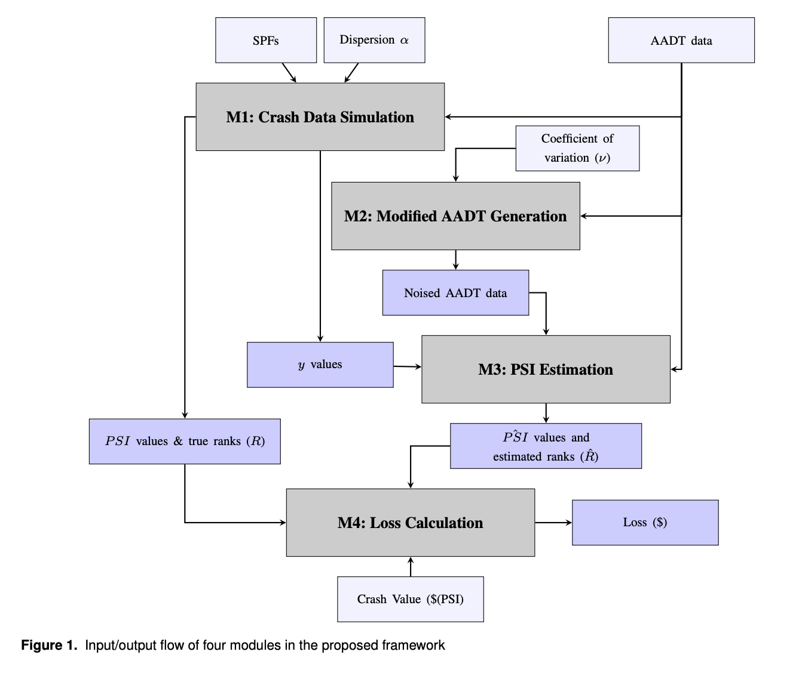
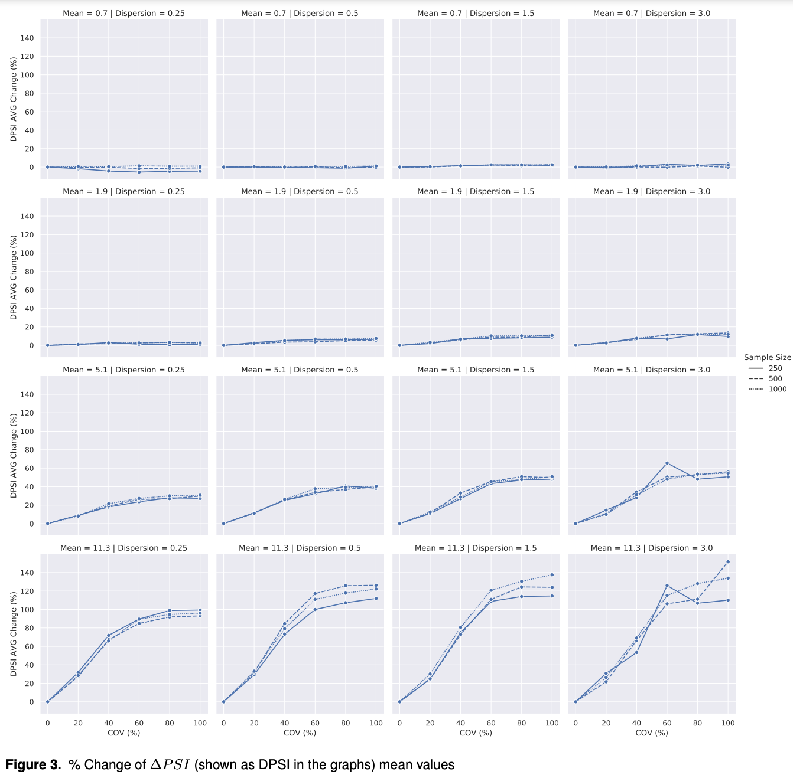
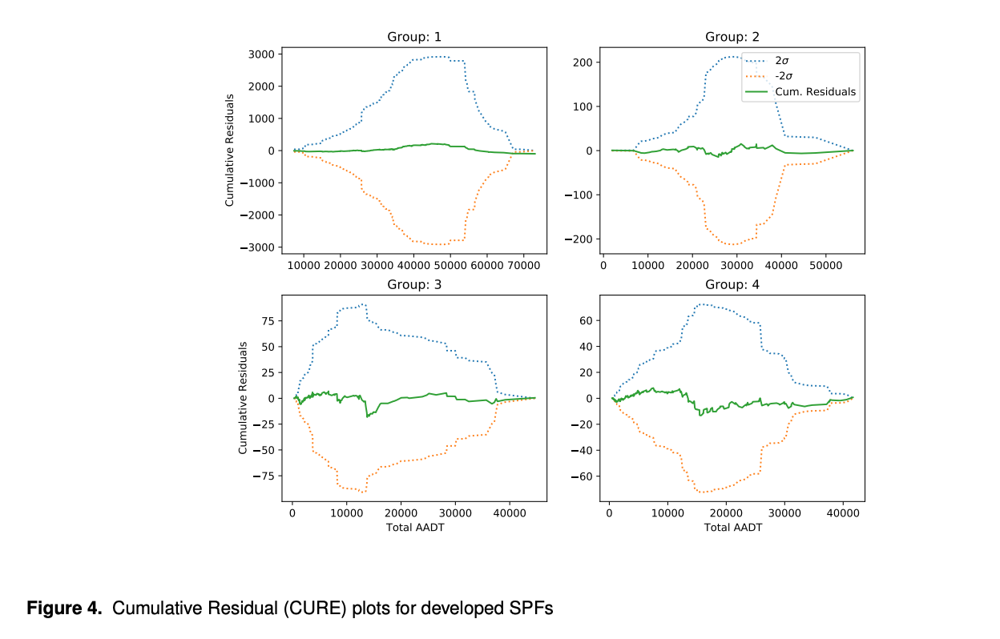

# Code for paper: A Method for Estimating The Monetary Benefit of Improving AADT Accuracy in The Context of Road Safety Network Screening

# Abstract
Conventional road safety network screening relies on measures of historical crash data and annual average daily traffic (AADT) as a measure of exposure to develop safety performance functions.  AADT is typically estimated from short-term counts and contains error which can negatively impact network screening outcomes and result in the inefficient allocation of safety improvement resources. In this paper, we propose a simulation-based method for quantifying the monetary benefit of improving AADT accuracy. The results of applying the method under various conditions show that crash data sets with higher sample mean and dispersion parameter values are more sensitive to AADT error and consequently benefit more from improving AADT accuracy. The use of the proposed method is illustrated through the application to a real-world example.

# Framework

# Snapshots from the tesults

